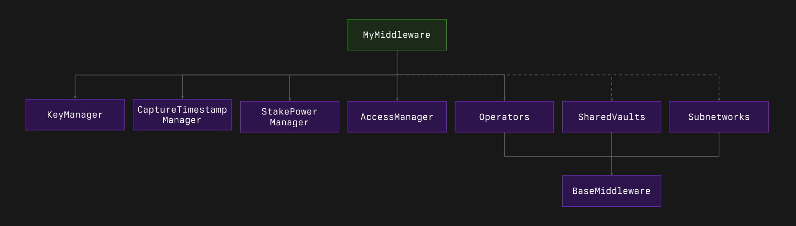

# Middleware Development Guide

**Warning: The SDK is a work in progress and is currently under audits. Breaking changes may occur in SDK updates as well as backward compatibility is not guaranteed. Use with caution.**

This repository provides a framework for developing middleware in a modular and extensible way. It leverages various base contracts and extensions to handle key functionalities such as operator management, access control, key storage, timestamp capturing and stake to power calculation.

## Key Components:



- **BaseMiddleware**: The foundational contract that combines core manager functionalities from `VaultManager`, `OperatorManager`, `AccessManager`, and `KeyManager`.

- **Extensions**: Modular contracts that provide additional functionalities. Key extensions include:

  - **Operators**: Manages operator registration and operator's vault.
  
  - **KeyManager**: Manages operator keys. Variants include `KeyManagerAddress`, `KeyManager256`, `KeyManagerBytes`, and `NoKeyManager`.
  
  - **AccessManager**: Controls access to restricted functions. Implementations include `OwnableAccessManager`, `OzAccessControl`, `OzAccessManaged`, and `NoAccessManager`.
  
  - **CaptureTimestamp**: Captures the active state at specific timestamps. Options are `EpochCapture` and `TimestampCapture`.
  
  - **Signature Verification**: Verifies operator signatures. Implementations include `ECDSASig` and `EdDSASig`.

  - **StakePower**: Calculates operator power based on stake. Implementations include `EqualStakePower` for 1:1 stake-to-power ratio, and can be extended for custom power calculations.

  - **SharedVaults**: Manages vaults shared between all operators.

  - **Subnetworks**: Manages subnetworks.


## Middleware Examples

Below are examples of middleware implementations using different combinations of the extensions.

#### SimplePosMiddleware
```solidity
contract SimplePosMiddleware is SharedVaults, Operators, KeyManager256, OwnableAccessManager, EpochCapture, EqualStakePower {
    // Implementation details...
}
```

Features:

- Manages operator keys and stakes.
- Retrieves validator sets and total stakes.
- Implements slashing logic based on epochs.

#### SqrtTaskMiddleware

```solidity
contract SqrtTaskMiddleware is SharedVaults, Operators, NoKeyManager, EIP712, OwnableAccessManager, TimestampCapture, EqualStakePower {
    // Implementation details...
}
```

Features:

- Allows creation of computational tasks.
- Verifies task completion using signatures.
- Implements slashing for incorrect task completion.

#### SelfRegisterMiddleware

```solidity
contract SelfRegisterMiddleware is SharedVaults, SelfRegisterOperators, KeyManagerAddress, ECDSASig, NoAccessManager, TimestampCapture, EqualStakePower {
    // Implementation details...
}
```

Features:

- Operators can self-register using ECDSA signatures.
- Manages operator keys and vault associations.
- No access restrictions on functions.

#### SelfRegisterEd25519Middleware

```solidity
contract SelfRegisterEd25519Middleware is SharedVaults, SelfRegisterOperators, KeyManager256, EdDSASig, NoAccessManager, TimestampCapture {
    // Implementation details...
}
```

Features:

- Similar to `SelfRegisterMiddleware` but uses Ed25519 keys and EdDSA signatures.

#### SelfRegisterSqrtTaskMiddleware

```solidity
contract SelfRegisterSqrtTaskMiddleware is SharedVaults, SelfRegisterOperators, KeyManagerAddress, ECDSASig, OwnableAccessManager, TimestampCapture, EqualStakePower {
    // Implementation details...
}
```

Features:

- Similar to `SqrtTaskMiddleware` but allows self-registration of operators, permissionless shared vaults management and uses ECDSA signatures and keys.

## Getting Started

To develop your middleware:

1. **Choose Extensions**: Based on your requirements, include extensions for operator management, key storage, access control, and timestamp capturing.

2. **Initialize Properly**: Ensure all inherited contracts are properly initialized:
   - Write an initialization function with the `initializer` modifier
   - Call `_disableInitializers()` in the constructor for upgradeable contracts
   - Initialize `BaseMiddleware` and extensions in the correct order
   - Pass required parameters to each contract's initialization function
   - Follow initialization order from most base to most derived contract
   - Note: If your contract is not upgradeable, initialization can be done directly in the constructor:
     ```solidity
     constructor(
         address network,
         uint48 slashingWindow,
         address vaultRegistry,
         address operatorRegistry,
         address operatorNetOptIn,
         address readHelper,
         address admin
     ) {
         initialize(network, slashingWindow, vaultRegistry, operatorRegistry, operatorNetOptIn, readHelper, admin);
     }
     ```
   - Example initialization pattern:
     ```solidity
     function initialize(
         address network,
         uint48 slashingWindow,
         address vaultRegistry,
         address operatorRegistry,
         address operatorNetOptIn,
         address readHelper,
         address admin
     ) public initializer {
         __BaseMiddleware_init(network, slashingWindow, vaultRegistry, operatorRegistry, operatorNetOptIn, readHelper);
         __OzAccessManaged_init(admin);
         __AdditionalExtension_init();
     }
     ```

3. **Custom Logic** (Optional): Override manager functions to implement custom logic without using extensions (e.g. `StakePower` manager). Additionally, implement your own functions to extend the middleware's capabilities.

## Example: Creating a Custom Middleware

```solidity
contract MyCustomMiddleware is BaseMiddleware, Operators, KeyStorage256, OwnableAccessManager {
    uint64 public constant MyCustomMiddleware_VERSION = 1;

    /**
     * @notice Override getCaptureTimestamp to provide custom timestamp logic
     * @return timestamp The current block timestamp
     */
    function getCaptureTimestamp() public view override returns (uint48 timestamp) {
        return uint48(block.timestamp);
    }

    /**
     * @notice Custom function to calculate the square of a given number
     * @param number The number to be squared
     * @return result The square of the given number
     */
    function calculateSquare(uint256 number) public pure returns (uint256 result) {
        return number * number;
    }
}
```

4. **Configure Access Control** (Optional): When using access control extensions, set up roles and permissions:

   ```solidity
   // Define role identifiers as constants
   bytes32 public constant OPERATOR_ROLE = keccak256("OPERATOR_ROLE");
   bytes32 public constant VAULT_ROLE = keccak256("VAULT_ROLE");
   bytes32 public constant MANAGER_ROLE = keccak256("MANAGER_ROLE");

   function initialize(...) public initializer {
       // Initialize base contracts
       __BaseMiddleware_init(...);
       __OzAccessControl_init(admin);

       // Set up role hierarchy
       _setRoleAdmin(OPERATOR_ROLE, MANAGER_ROLE); // Manager role can grant/revoke operator role
       _setRoleAdmin(VAULT_ROLE, MANAGER_ROLE); // Manager role can grant/revoke vault role
       _setRoleAdmin(MANAGER_ROLE, DEFAULT_ADMIN_ROLE); // Default admin can grant/revoke manager role

       // Assign roles to function selectors
       _setSelectorRole(this.registerOperator.selector, OPERATOR_ROLE);
       _setSelectorRole(this.registerVault.selector, VAULT_ROLE);
       _setSelectorRole(this.updateParameters.selector, MANAGER_ROLE);

       // Grant initial roles
       _grantRole(MANAGER_ROLE, admin);
   }
   ```

## Notes

- **Storage Slots**: When creating extensions, ensure you follow the ERC-7201 standard for storage slot allocation to prevent conflicts.

- **Versioning**: Include a public constant variable for versioning in your contracts (e.g., `uint64 public constant MyExtension_VERSION = 1;`).

- **Access Control**: Choose an appropriate `AccessManager` based on your needs:
  - `NoAccessManager`: Allows unrestricted access to all functions
  - `OwnableAccessManager`: Restricts access to a single owner address
  - `OzAccessControl`: Implements OpenZeppelin-style role-based access control where different roles can be assigned to specific function selectors. Roles can be granted and revoked by role admins, with a default admin role that can manage all other roles. Roles can be set up by:
    1. Granting roles to addresses using `grantRole(bytes32 role, address account)`
    2. Setting role admins with `_setRoleAdmin(bytes32 role, bytes32 adminRole)` 
    3. Assigning roles to function selectors via `_setSelectorRole(bytes4 selector, bytes32 role)`
  - `OzAccessManaged`: Wraps OpenZeppelin's AccessManaged contract to integrate with external access control systems. This allows for more complex access control scenarios where permissions are managed externally, providing flexibility and scalability in managing roles and permissions.
  
- **Key Manager**: Choose a `KeyManager` implementation that suits your key management needs. Use `KeyManagerAddress` for managing address keys, `KeyManager256` for managing 256-bit keys, `KeyManagerBytes` for handling arbitrary-length keys, or `NoKeyManager` if key management is not required.

This framework provides flexibility in building middleware by allowing you to mix and match various extensions based on your requirements. By following the modular approach and best practices outlined, you can develop robust middleware solutions that integrate seamlessly with the network.

## License

This project is licensed under the MIT License. See the [LICENSE](LICENSE) file for details.
