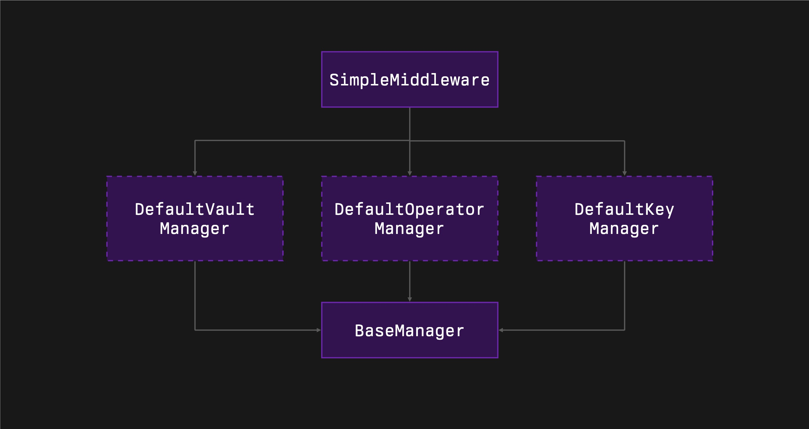

# Middleware SDK

The Symbiotic Middleware SDK is a collection of foundational contracts and libraries designed to simplify the development of network middleware on the Symbiotic platform. It provides essential functionalities such as operator management, key handling, vault interactions, subnetwork operations, and slashing mechanisms. This SDK enables developers to create custom middleware solutions tailored to their network's requirements with ease.

## Table of Contents

- [Features](#features)
- [Architecture](#architecture)
- [Usage](#usage)
  - [Libraries](#libraries)
    - [PauseableEnumerableSet Library](#pauseableenumerableset-library)
  - [Contracts](#contracts)
    - [BaseManager Contract](#basemanager-contract)
    - [Operator Management Modules](#operator-management-modules)
    - [Vault Management Modules](#vault-management-modules)
    - [Key Management Modules](#key-management-modules)
    - [Subnetwork Management](#subnetwork-management)
  - [Examples](#examples)
    - [SimpleMiddleware Example](#simplemiddleware-example)
    - [SqrtTaskMiddleware Example](#sqrttaskmiddleware-example)
    - [Writing Your Own Network Middleware](#writing-your-own-network-middleware)
    - [Custom Modules](#custom-modules)
      - [Example: Self-Register Operator Manager](#example-self-register-operator-manager)
- [Important Notes](#important-notes)
- [License](#license)

## Features

- **Operator Management**: Register, pause, unpause, and manage operators within the network.
- **Vault Management**: Interact with vaults for staking, power calculation, and slashing mechanisms.
- **Key Management**: Handle operator keys (both general and BLS keys), including updates and activity checks.
- **Subnetwork Support**: Manage multiple subnetworks within the main network, including registration and pausing.
- **Epoch Management**: Utilities for handling epochs, including start times and durations.
- **Slashing Mechanisms**: Implement instant and veto-based slashing for misbehaving operators.
- **Extensibility**: Ability to write custom modules to extend or modify the SDK's functionalities.
- **Example Implementations**: Includes example contracts demonstrating how to extend and use the SDK.

## Architecture

The SDK is organized into modular components, each responsible for managing a specific aspect of the middleware:

- **Libraries**: Reusable code segments such as `PauseableEnumerableSet` for managing enumerable sets with pause functionality.
- **Contracts**: Core contracts like `BaseManager`, `OperatorManager`, `VaultManager`, and key managers that provide essential middleware functionalities.
- **Examples**: Sample implementations like `SimpleMiddleware` and `SqrtTaskMiddleware` to illustrate how to build upon the SDK.
- **Custom Modules**: The SDK allows for the creation of custom modules to extend or override default behaviors, enabling developers to tailor the middleware to their specific needs.

Developers can inherit from these modules and extend them to implement custom logic tailored to their specific requirements.



## Usage

### Libraries

#### PauseableEnumerableSet Library

The `PauseableEnumerableSet` library extends the functionality of enumerable sets by adding pause and unpause capabilities to individual elements within the set.

**Features:**

- Manage sets of `address` or `uint160` values.
- Pause and unpause individual elements.
- Track enabled and disabled epochs for each element.
- Prevent operations on paused elements until they are unpaused.
- Ensure data consistency by enforcing immutable periods before certain actions can be reversed.

### Contracts

#### BaseManager Contract

The `BaseManager` contract is an abstract base contract that provides foundational middleware functionalities, including epoch management, subnetwork handling, and immutable period configurations.

**Key Features:**

- **Epoch Management**: Calculate current epoch, epoch start times, and manage epoch durations.
- **Subnetwork Management**: Register, pause, unpause, and unregister subnetworks.
- **Immutable Epochs**: Enforce immutable periods before certain actions (like unpausing) can be performed.
- **Slashing Window Configuration**: Set slashing windows relative to epoch durations to ensure timely slashing actions.

**Key Functions:**

- `getCurrentEpoch() → uint32`: Returns the current epoch based on the timestamp.
- `getEpochStart(uint32 epoch) → uint48`: Returns the start timestamp of a given epoch.
- `registerSubnetwork(uint96 subnetwork)`: Registers a new subnetwork.
- `pauseSubnetwork(uint96 subnetwork)`: Pauses an active subnetwork.
- `unpauseSubnetwork(uint96 subnetwork)`: Unpauses a subnetwork after the immutable period.
- `unregisterSubnetwork(uint96 subnetwork)`: Unregisters a subnetwork.
- `subnetworksLength() → uint256`: Returns the number of registered subnetworks.
- `activeSubnetworks() → uint160[]`: Returns a list of active subnetworks.

#### Operator Management Modules

The SDK provides modules for managing operators within the network.

- **`BaseOperatorManager` Contract**: Provides internal functions for operator management, including registration, pausing, unpausing, and unregistration.
- **`DefaultOperatorManager` Contract**: Inherits from `BaseOperatorManager` and exposes public functions callable by the contract owner.

**Key Functions:**

- `registerOperator(address operator)`: Registers a new operator.
- `pauseOperator(address operator)`: Pauses an operator, making them inactive.
- `unpauseOperator(address operator)`: Unpauses a paused operator after the immutable period.
- `unregisterOperator(address operator)`: Unregisters an operator from the network.
- `operatorsLength() → uint256`: Returns the total number of registered operators.
- `operatorWithTimesAt(uint256 pos) → (address, uint32, uint32, uint32)`: Retrieves operator details at a specific index.
- `activeOperators() → address[]`: Returns a list of active operators.

#### Vault Management Modules

The SDK includes modules for managing vaults, which are critical for staking and slashing operations.

- **`BaseVaultManager` Contract**: Provides core functionalities for vault management, including stake calculation and slashing mechanisms.
- **`DefaultVaultManager` Contract**: Extends `BaseVaultManager` to include public methods for managing vaults.

**Key Functions:**

- `registerSharedVault(address vault)`: Registers a new shared vault accessible by all operators.
- `registerOperatorVault(address operator, address vault)`: Registers a new operator-specific vault.
- `pauseSharedVault(address vault)`: Pauses a shared vault.
- `unpauseSharedVault(address vault)`: Unpauses a shared vault after the immutable period.
- `pauseOperatorVault(address operator, address vault)`: Pauses an operator-specific vault.
- `unpauseOperatorVault(address operator, address vault)`: Unpauses an operator vault after the immutable period.
- `unregisterSharedVault(address vault)`: Unregisters a shared vault.
- `unregisterOperatorVault(address operator, address vault)`: Unregisters an operator-specific vault.
- `sharedVaultsLength() → uint256`: Returns the number of shared vaults.
- `sharedVaultWithEpochsAt(uint256 pos) → (address, uint32, uint32, uint32)`: Retrieves shared vault details at a specific index.
- `operatorVaultsLength(address operator) → uint256`: Returns the number of vaults for a specific operator.
- `operatorVaultWithEpochsAt(address operator, uint256 pos) → (address, uint32, uint32, uint32)`: Retrieves operator vault details at a specific index.
- `getOperatorStake(address operator) → uint256`: Returns the stake of an operator in the current epoch.
- `getOperatorPower(address operator) → uint256`: Returns the power of an operator based on their stake. This function can be overridden to implement custom stake-to-power logic.

**Implementing Custom `stakeToPower` Logic:**

```solidity
function stakeToPower(address vault, uint256 stake) public view virtual override returns (uint256) {
    // Implement custom logic to convert stake to power
    // For example, use an oracle to price different vault assets or weight vaults differently
    uint256 assetPrice = getAssetPriceFromOracle(vault);
    return stake * assetPrice;
}
```

**Explanation:**

The `stakeToPower` function is critical for converting an operator's stake into power, which can influence their weight in consensus mechanisms or voting. By overriding this function, you can implement custom logic to:

- **Price Different Vault Assets Using an Oracle**: If your operators stake assets with varying market values, you can integrate with an oracle to fetch real-time prices. This ensures that the power assigned to an operator accurately reflects the current value of their staked assets.

- **Weight Vaults Differently**: You may assign different weights to vaults based on criteria such as asset volatility, liquidity, or strategic importance. By adjusting the power calculation, you can incentivize operators to stake in preferred vaults or balance the network according to your needs.

This flexibility allows you to create a more nuanced and fair system that reflects the true value of stakes from different vaults.

#### Key Management Modules

Key management is essential for operator authentication and validation. The SDK provides modules for managing both general keys and BLS keys.

- **`BaseKeyManager` Contract**: Manages general keys associated with operators.
- **`DefaultKeyManager` Contract**: Extends `BaseKeyManager` to expose public methods for key management.
- **`BaseBLSKeyManager` Contract**: Specifically manages BLS (Boneh–Lynn–Shacham) cryptographic keys.
- **`DefaultBLSKeyManager` Contract**: Extends `BaseBLSKeyManager` to expose public methods.

**Key Functions (General Key Management):**

- `updateKey(address operator, bytes32 key)`: Updates the key associated with an operator.
- `operatorKey(address operator) → bytes32`: Retrieves the current key of an operator.
- `operatorByKey(bytes32 key) → address`: Returns the operator associated with a specific key.
- `keyWasActiveAt(uint32 epoch, bytes32 key) → bool`: Checks if a key was active during a specific epoch.

**Key Functions (BLS Key Management):**

- `updateBLSKey(address operator, bytes memory key)`: Updates the BLS key associated with an operator.
- `operatorBLSKey(address operator) → bytes memory`: Retrieves the current BLS key of an operator.
- `operatorByBLSKey(bytes memory key) → address`: Returns the operator associated with a specific BLS key.
- `blsKeyWasActiveAt(uint32 epoch, bytes memory key) → bool`: Checks if a BLS key was active during a specific epoch.

#### Subnetwork Management

Subnetworks allow for segmented management within the main network.

**Key Functions:**

- `registerSubnetwork(uint96 subnetwork)`: Registers a new subnetwork.
- `pauseSubnetwork(uint96 subnetwork)`: Pauses an active subnetwork.
- `unpauseSubnetwork(uint96 subnetwork)`: Unpauses a subnetwork after the immutable period.
- `unregisterSubnetwork(uint96 subnetwork)`: Unregisters a subnetwork.
- `subnetworksLength() → uint256`: Returns the number of subnetworks.
- `subnetworkWithTimesAt(uint256 pos) → (uint160, uint32, uint32, uint32)`: Retrieves subnetwork details at a specific index.
- `activeSubnetworks() → uint160[]`: Returns a list of active subnetworks.

### Examples

#### SimpleMiddleware Example

The `SimpleMiddleware` contract demonstrates how to combine various modules to build a middleware that manages validators and handles slashing.

**Features:**

- **Validator Set Construction**: Compiles a list of active validators based on the current epoch.
- **Power Calculation**: Calculates the power of each validator, which can be used for consensus mechanisms.
- **Slashing Mechanism**: Implements a `slash` function to penalize misbehaving operators proportionally to their stake.

**Key Structures and Functions:**

- **ValidatorData Struct**:

  ```solidity
  struct ValidatorData {
      uint256 power;
      bytes32 key;
  }
  ```

- `getTotalStake() → uint256`: Returns the total stake of all active operators.
- `getTotalPower() → uint256`: Returns the total power of all active operators.
- `getValidatorSet() → ValidatorData[]`: Retrieves the current validator set.
- `slash(uint32 epoch, bytes32 key, uint256 amount, bytes[][] memory stakeHints, bytes[] memory slashHints) → SlashResponse[]`: Executes slashing on a misbehaving operator.

**Note on `stakeToPower` in SimpleMiddleware:**

In the `SimpleMiddleware` example, you can override the `stakeToPower` function to use an oracle for pricing different vault assets or weighting vaults differently. This allows the middleware to accurately reflect the value of stakes from various vaults, ensuring a fair and balanced validator set.

For instance:

```solidity
function stakeToPower(address vault, uint256 stake) public view virtual override returns (uint256) {
    // Use an oracle to get the price of the asset staked in the vault
    uint256 assetPrice = oracle.getPrice(vault);
    // Convert stake to power based on asset price
    return stake * assetPrice;
}
```

#### SqrtTaskMiddleware Example

The `SqrtTaskMiddleware` contract is an advanced example showing how to implement custom logic in the middleware. It extends the default modules and introduces a task-based system where operators solve computational tasks.

**Features:**

- **Task Creation**: Users can create tasks by specifying a value and an operator.
- **Task Completion**: Operators submit solutions along with signatures. The middleware verifies the solution and signature.
- **Custom Slashing**: Operators are slashed if they provide incorrect solutions.

**Key Structures and Functions:**

- **Task Struct**:

  ```solidity
  struct Task {
      uint48 captureTimestamp;
      uint256 value;
      address operator;
      bool completed;
  }
  ```

- `createTask(uint256 value, address operator) → uint256`: Creates a new task for an operator.
- `completeTask(uint256 taskIndex, uint256 answer, bytes calldata signature, bytes[] calldata stakeHints, bytes[] calldata slashHints) → bool`: Allows an operator to complete a task and checks the validity of the answer.
- `_verify(uint256 taskIndex, uint256 answer, bytes calldata signature) → bool`: Verifies the operator's answer and signature.
- `_slash(uint256 taskIndex, bytes[] calldata stakeHints, bytes[] calldata slashHints)`: Executes slashing if the operator's answer is incorrect.

**Note:**

In `SqrtTaskMiddleware`, subnetworks are not used, and attempts to manage subnetworks are disabled by overriding the functions and reverting:

```solidity
function registerSubnetwork(uint96 subnetwork) public pure override {
    revert();
}

// Similar overrides for other subnetwork functions...
```

### Writing Your Own Network Middleware

The Middleware SDK is designed to be flexible and extensible, allowing you to create custom network middleware tailored to your specific requirements. This section guides you through the process of writing your own network middleware using the SDK modules.

#### Steps to Build Your Custom Middleware

1. **Define Your Middleware's Purpose and Requirements**

   - **Identify Functionalities**: Determine what functionalities your middleware needs to provide, such as custom slashing conditions, validator set management, or unique staking mechanisms.
   - **Select Modules**: Decide which SDK modules are necessary for your middleware (e.g., operator management, vault management, key management).
   - **Custom Logic**: Consider any custom logic or features you need to implement beyond the provided modules.

2. **Select and Import the Necessary Modules**

   - **Import Modules**: Import the base or default modules that provide the required functionalities.
   - **Example Imports**:

     ```solidity
     import {DefaultOperatorManager} from "./OperatorManagers/DefaultOperatorManager.sol";
     import {DefaultVaultManager} from "./VaultManagers/DefaultVaultManager.sol";
     import {DefaultKeyManager} from "./KeyManagers/DefaultKeyManager.sol";
     ```

3. **Create Your Middleware Contract**

   - **Inherit Modules**: Inherit from the selected modules to compose your middleware contract.
   - **Example Contract Structure**:

     ```solidity
     contract CustomMiddleware is DefaultOperatorManager, DefaultVaultManager, DefaultKeyManager {
         // Custom logic here
     }
     ```

4. **Implement Custom Logic**

   - **Override Functions**: Override base functions to introduce custom behavior.
   - **Example: Custom `stakeToPower` Function**:

     ```solidity
     function stakeToPower(address vault, uint256 stake) public view virtual override returns (uint256) {
         // Implement custom logic to convert stake to power
         uint256 assetPrice = getAssetPriceFromOracle(vault);
         return stake * assetPrice;
     }
     ```

   - **Add New Functions**: Implement new functions for additional processes, such as specialized slashing conditions or custom validator selection criteria.
   - **Example: Custom Slashing Logic**:

     ```solidity
     function customSlash(address operator, uint256 penalty) public onlyOwner {
         // Custom slashing logic
         // For example, slash a fixed penalty amount from the operator's stake
         // Implement the slashing mechanism according to your network's rules
     }
     ```

5. **Handle Epoch and State Management**

   - **Epoch Utilities**: Use the epoch management utilities provided by `BaseManager` to handle time-based state changes.
   - **State Transitions**: Ensure that your middleware correctly manages state transitions between epochs, especially if your custom logic depends on epoch-specific data.

### Custom Modules

The Middleware SDK not only provides default modules but also allows developers to create custom modules to extend or modify the SDK's functionalities. This enables you to tailor the middleware to fit unique requirements that may not be covered by the default modules.

#### Example: Self-Register Operator Manager

In some networks, it might be desirable for operators to register themselves without the intervention of the contract owner or an administrator. Below is an example of how you can create a custom operator manager module that allows for self-registration, using the internal functions from `BaseOperatorManager`, similar to `DefaultOperatorManager`.

##### Creating a Self-Register Operator Manager

1. **Create a New Contract**

   ```solidity
   // SPDX-License-Identifier: MIT
   pragma solidity ^0.8.25;

   import {BaseOperatorManager} from "./BaseOperatorManager.sol";

   contract SelfRegisterOperatorManager is BaseOperatorManager {
       error AlreadyRegistered();
       error NotOptedIn();
       error NotOperator();

       constructor() {
           // Initialization if needed
       }

       function registerOperator() public {
           address operator = msg.sender;
           _registerOperator(operator);
       }

       function unregisterOperator() public {
           address operator = msg.sender;
           _unregisterOperator(operator);
       }

       // Optionally, you can allow operators to pause and unpause themselves
       function pauseOperator() public {
           address operator = msg.sender;
           _pauseOperator(operator);
       }

       function unpauseOperator() public {
           address operator = msg.sender;
           _unpauseOperator(operator);
       }
   }
   ```

2. **Using Internal Functions**

   In this example, the `SelfRegisterOperatorManager` contract extends `BaseOperatorManager` and exposes public functions that internally call the protected functions provided by `BaseOperatorManager`. This approach mirrors how `DefaultOperatorManager` operates but allows operators to register themselves.

3. **Self-Registration Logic**

   The internal functions `_registerOperator`, `_unregisterOperator`, `_pauseOperator`, and `_unpauseOperator` handle validation and state changes. By using these functions, you ensure consistency and reuse the existing logic.

4. **Error Handling and Validation**

   The internal functions already include necessary validations, such as checking if the operator is a valid entity and has opted in. Therefore, you can rely on these internal functions for error handling.

5. **Integrate the Custom Module**

   In your middleware contract, inherit from `SelfRegisterOperatorManager` instead of `DefaultOperatorManager`:

   ```solidity
   contract CustomMiddleware is SelfRegisterOperatorManager, DefaultVaultManager, DefaultKeyManager {
       // Custom logic here
   }
   ```

6. **Benefits**

   - **Reusability**: By using the internal functions from `BaseOperatorManager`, you ensure consistency with the SDK's architecture.
   - **Encapsulation**: Internal functions handle validation and state changes, keeping your public functions clean and focused.
   - **Flexibility**: Operators can manage their participation autonomously.

## Important Notes

- **Epoch-Based Data**: Most data is relevant only for the current epoch. Ensure that data is fetched at the finalized block moment using calls at specific blocks.
- **Immutable Periods**: Certain actions, like unpausing operators or vaults, require waiting for an immutable period (specified in epochs) before they can be reversed.
- **Slashing Windows**: The slashing window is the duration during which a slashing action can be executed after misbehavior is detected. It should be set appropriately relative to the epoch duration.
- **Finalized Blocks**: Networks typically operate on finalized blocks. Use finalized blocks to retrieve data to avoid discrepancies due to chain reorganizations or forks.
- **Data Consistency**: Be mindful that most state changes are epoch-bound, and historical data may not reflect the current state. Design your middleware to account for this.

## License

This project is licensed under the [MIT License](LICENSE).

---

For any questions, issues, or contributions, please open an issue or submit a pull request on the repository.